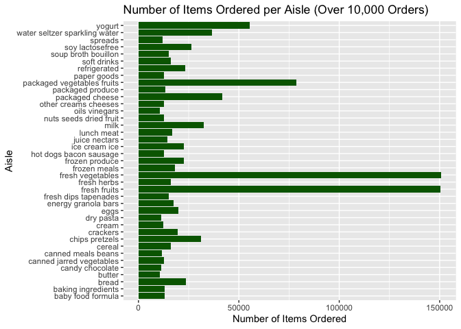
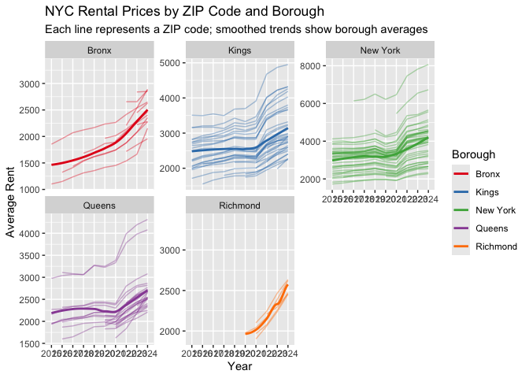
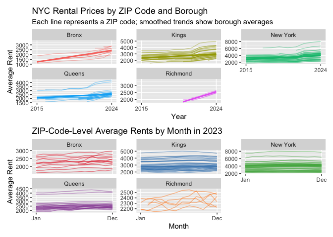
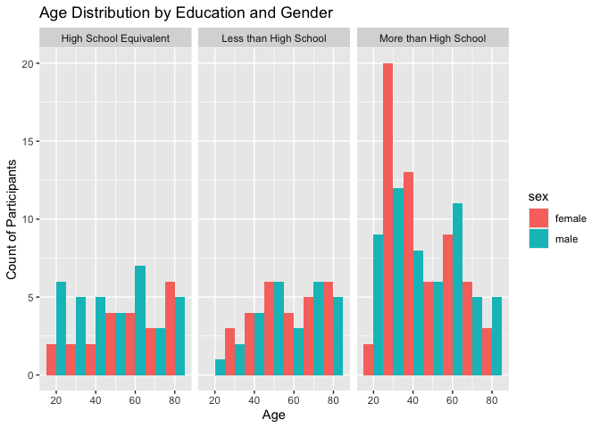
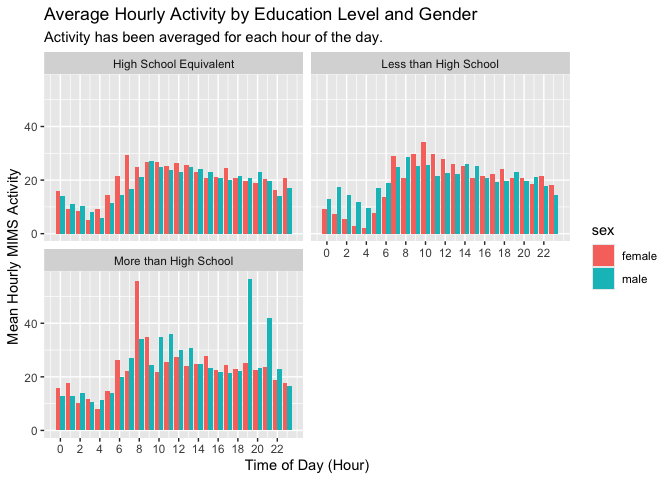

p8105_hw3_ab6168
================
Angelica Bailey
2025-10-06

## Problem 1

``` r
library(tidyverse)
library(p8105.datasets)
library(patchwork)
```

Loading instacart dataset

``` r
data("instacart")
```

<br>

**Description**:

The `instacart` data set contains information on grocery orders placed
in 2017 by 131,209 unique users and includes 1,384,617 observations.
There are a total of 15 variables describing the details of the order,
product, and customer behavior. Each row in the data set is a product
from an order. Key variables include:

- `order_id` – Unique identifier for each order

- `user_id` - Unique customer identifier

- `product_id` and `product_name` - Identify the specific item purchased

- `add_to_cart_order` - The sequence in which each product was added to
  the cart

- `reordered` - Indicates whether product had been purchased by the user
  before

- `order_dow` and `order_hour_of_day` - Represent when the order was
  placed

- `aisle` and `department` - Describe the product’s category

A few observations:

- A total of 39123 unique products have been ordered.

- From the table below we can see the three most ordered products are
  bananas, strawberries, and spinach.

``` r
knitr::kable(instacart |> count(product_name, sort = TRUE) |> 
               slice_head(n = 10))
```

| product_name           |     n |
|:-----------------------|------:|
| Banana                 | 18726 |
| Bag of Organic Bananas | 15480 |
| Organic Strawberries   | 10894 |
| Organic Baby Spinach   |  9784 |
| Large Lemon            |  8135 |
| Organic Avocado        |  7409 |
| Organic Hass Avocado   |  7293 |
| Strawberries           |  6494 |
| Limes                  |  6033 |
| Organic Raspberries    |  5546 |

<br> <br>

**How many aisles are there, and which aisles are the most items ordered
from?**

``` r
#getting number of unique aisles
instacart |> summarise(n_distinct(aisle))
```

    ## # A tibble: 1 × 1
    ##   `n_distinct(aisle)`
    ##                 <int>
    ## 1                 134

``` r
#finding aisles with the most items ordered
instacart |> count(aisle, sort = TRUE)
```

    ## # A tibble: 134 × 2
    ##    aisle                              n
    ##    <chr>                          <int>
    ##  1 fresh vegetables              150609
    ##  2 fresh fruits                  150473
    ##  3 packaged vegetables fruits     78493
    ##  4 yogurt                         55240
    ##  5 packaged cheese                41699
    ##  6 water seltzer sparkling water  36617
    ##  7 milk                           32644
    ##  8 chips pretzels                 31269
    ##  9 soy lactosefree                26240
    ## 10 bread                          23635
    ## # ℹ 124 more rows

There are **134 aisles**. Most items are ordered from the **Fresh
Vegetables** and **Fresh Fruits** aisle.

<br>

**Plot showing the number of items ordered in each aisle.**

``` r
#making bar chart
instacart |> 
  count(aisle, sort = TRUE) |>  #count of items for each aisle
  filter(n > 10000) |> 
  ggplot(aes(x = aisle, y = n)) +
  geom_col(fill = "darkgreen") +
  coord_flip() +  # flip for readability
  labs(
    title = "Number of Items Ordered per Aisle (Over 10,000 Orders)",
       x = "Aisle",
       y = "Number of Items Ordered"
    )
```

<!-- -->

<br>

**Three most popular items in each of the aisles “baking ingredients”,
“dog food care”, and “packaged vegetables fruits”:**

``` r
knitr::kable(
  instacart |>  
  filter(aisle == c("baking ingredients", 
                      "dog food care", 
                      "packaged vegetables fruits")
         ) |> 
  count(aisle, product_name, sort = TRUE) |>  
  group_by(aisle) |>  
  slice_max(order_by = n, n = 3)
)
```

| aisle | product_name | n |
|:---|:---|---:|
| baking ingredients | Light Brown Sugar | 157 |
| baking ingredients | Pure Baking Soda | 140 |
| baking ingredients | Organic Vanilla Extract | 122 |
| dog food care | Organix Grain Free Chicken & Vegetable Dog Food | 14 |
| dog food care | Organix Chicken & Brown Rice Recipe | 13 |
| dog food care | Original Dry Dog | 9 |
| packaged vegetables fruits | Organic Baby Spinach | 3324 |
| packaged vegetables fruits | Organic Raspberries | 1920 |
| packaged vegetables fruits | Organic Blueberries | 1692 |

<br>

**Mean hour of the day at which Pink Lady Apples and Coffee Ice Cream
are ordered on each day of the week:**

``` r
knitr::kable(instacart |> 
  filter(
    product_name %in% c("Pink Lady Apples", "Coffee Ice Cream")) |>  
  group_by(product_name, order_dow) |>  
  summarise(
    mean_hour = round(mean(order_hour_of_day),1), .groups = "drop") |> 
  pivot_wider(        
    names_from = order_dow, 
    values_from = mean_hour)
)
```

| product_name     |    0 |    1 |    2 |    3 |    4 |    5 |    6 |
|:-----------------|-----:|-----:|-----:|-----:|-----:|-----:|-----:|
| Coffee Ice Cream | 13.8 | 14.3 | 15.4 | 15.3 | 15.2 | 12.3 | 13.8 |
| Pink Lady Apples | 13.4 | 11.4 | 11.7 | 14.2 | 11.6 | 12.8 | 11.9 |

<br> <br>

## Problem 2

Tidying Zillow datasets

``` r
zori_df =
  read_csv("data/zori_NYC.csv") |> 
  select(-StateName, -State, -City, -Metro, - RegionType) |> 
  #renaming variables
  rename(
    region_id = "RegionID",
    size_rank = "SizeRank",
    zip_code = "RegionName",
    county = "CountyName"
    ) |> 
  mutate(
    county = str_remove(county," County")
  ) |>
  pivot_longer(
    cols = "2015-01-31":"2024-08-31",
    names_to = "date",
    values_to = "rent_price"
  )

zip_df = 
  read_csv("data/Zip Codes.csv") |> 
  janitor::clean_names() |> 
  select(-state_fips, -file_date)

#joining datasets
join_zillow_df = 
  left_join(zori_df, zip_df, by = c("zip_code", "county")) |> 
  drop_na(rent_price)
```

<br>

**How many ZIP codes are observed 116 times? How many are observed fewer
than 10 times? Why are some ZIP codes are observed rarely and others
observed in each month?**

``` r
#How many ZIP codes are observed 116 times?

join_zillow_df |> 
  count(zip_code) |> 
  filter(n == 116)
```

    ## # A tibble: 48 × 2
    ##    zip_code     n
    ##       <dbl> <int>
    ##  1    10001   116
    ##  2    10002   116
    ##  3    10003   116
    ##  4    10005   116
    ##  5    10010   116
    ##  6    10012   116
    ##  7    10013   116
    ##  8    10014   116
    ##  9    10017   116
    ## 10    10018   116
    ## # ℹ 38 more rows

There are **48 zip codes** that are observed 116 times.

``` r
#How many ZIP codes are observed fewer than 10 times?

join_zillow_df |> 
  count(zip_code) |> 
  filter(n < 10)
```

    ## # A tibble: 26 × 2
    ##    zip_code     n
    ##       <dbl> <int>
    ##  1    10044     9
    ##  2    10162     2
    ##  3    10303     2
    ##  4    10308     3
    ##  5    10453     1
    ##  6    10455     3
    ##  7    10456     4
    ##  8    10459     2
    ##  9    10460     2
    ## 10    10470     1
    ## # ℹ 16 more rows

There are **26 zip codes** that are observed fewer than 10 times.

Some ZIP codes may be observed rarely because there is a lack of
information on the rent prices for those zip codes depending on the
area. There may be little to no rent properties in certain areas.

<br>

**Table showing average rental price by borough and year**

``` r
avg_rent = join_zillow_df |> 
  #separating date
  separate(date,
    into = c("year", "month","day"), sep = "-") |> 
  group_by(county, year) |> 
  summarize(average_rent = round(mean(rent_price),1), .groups = "drop") |> 
  pivot_wider(
    names_from = county,
    values_from = average_rent
  )

knitr::kable(avg_rent)
```

| year |  Bronx |  Kings | New York | Queens | Richmond |
|:-----|-------:|-------:|---------:|-------:|---------:|
| 2015 | 1759.6 | 2492.9 |   3022.0 | 2214.7 |       NA |
| 2016 | 1520.2 | 2520.4 |   3038.8 | 2272.0 |       NA |
| 2017 | 1543.6 | 2545.8 |   3133.8 | 2263.3 |       NA |
| 2018 | 1639.4 | 2547.3 |   3183.7 | 2291.9 |       NA |
| 2019 | 1705.6 | 2630.5 |   3310.4 | 2387.8 |       NA |
| 2020 | 1811.4 | 2555.1 |   3106.5 | 2315.6 |   1977.6 |
| 2021 | 1857.8 | 2549.9 |   3136.6 | 2210.8 |   2045.4 |
| 2022 | 2054.3 | 2868.2 |   3778.4 | 2406.0 |   2147.4 |
| 2023 | 2285.5 | 3015.2 |   3932.6 | 2561.6 |   2332.9 |
| 2024 | 2496.9 | 3126.8 |   4078.4 | 2694.0 |   2536.4 |

First, we can see that Richmond county does not have data from 2015 to
2019. The most significant trend is the steep increase in rents across
most boroughs from 2021 to 2024. From 2019 to 2020, we see that prices
in boroughs like Manhattan, Brooklyn, and Queens dipped before
increasing back in 2021, reflecting the market disruption around 2020.

<br>

**Make a plot showing NYC Rental Prices within ZIP codes for all
available years. Your plot should facilitate comparisons across
boroughs.**

``` r
#average rent per zip per year
zip_avg = join_zillow_df |> 
  separate(date,
           into = c("year", "month","day"), sep = "-") |> 
  group_by(county, zip_code, year) |> 
  summarize(mean_rent = mean(rent_price, na.rm = TRUE), .groups = "drop")

#creating plot to compare rent across boroughs
plot1 = ggplot(zip_avg, aes(x = year, y = mean_rent, group = zip_code, color = county)) +
  geom_line(alpha = 0.4) +
  theme(legend.position = "none") +
  geom_smooth(aes(group = county, color = county), method = lm, se = FALSE, size = 1.0) +
  facet_wrap(~county, scales = "free_y") +
  scale_x_discrete(breaks = c("2015", "2024")) +
  labs(
    title = "NYC Rental Prices by ZIP Code and Borough",
    subtitle = "Each line represents a ZIP code; smoothed trends show borough averages",
    x = "Year",
    y = "Average Rent",
    color = "Borough"
  )
```

    ## Warning: Using `size` aesthetic for lines was deprecated in ggplot2 3.4.0.
    ## ℹ Please use `linewidth` instead.
    ## This warning is displayed once every 8 hours.
    ## Call `lifecycle::last_lifecycle_warnings()` to see where this warning was
    ## generated.

``` r
plot1
```

<!-- -->

Some significant elements of this plot are that in Manhattan and
Brooklyn, the spread of the rent prices across zip codes is large. In
Manhattan, some ZIP codes have average rents approaching \$8,000, while
others are closer to \$4,000. On the other hand, the lines for the
Bronx, Queens, and Richmond are more close around their average trend
lines. While there is still variation, the difference between the most
and least expensice neighborhoods are significantly smaller.

<br>

**Compute the average rental price within each ZIP code over each month
in 2023. Make a reader-friendly plot showing the distribution of
ZIP-code-level rental prices across boroughs**

``` r
#computing average rent within each zip in 2023
rent_2023 = join_zillow_df |> 
  separate(date,
           into = c("year", "month","day"), sep = "-") |> 
  filter(year == 2023) |> 
  group_by(county, zip_code, month) |> 
  summarize(avg_monthly_rent = mean(rent_price, na.rm = TRUE), .groups = "drop") |> 
  mutate(
    month = case_when(
      month == "01" ~ "Jan",
      month == "02" ~ "Feb",
      month == "03" ~ "Mar",
      month == "04" ~ "Apr",
      month == "05" ~ "May",
      month == "06" ~ "Jun",
      month == "07" ~ "Jul",
      month == "08" ~ "Aug",
      month == "09" ~ "Sep",
      month == "10" ~ "Oct",
      month == "11" ~ "Nov",
      month == "12" ~ "Dec"
    )
  ) |> 
  mutate(month = factor(month, levels = month.abb, ordered = TRUE))

#creating plot showing zip code average rent for each month in 2023
plot2 <- ggplot(rent_2023, aes(x = month, y = avg_monthly_rent, 
                      group = zip_code, color = county )) +
  geom_line(alpha = 0.5) +
  theme(legend.position = "none") +
  facet_wrap(~ county, scales = "free_y") +
  scale_color_brewer(palette = "Set1") +
  scale_x_discrete(breaks = c("Jan", "Dec")) +
  labs(
    title = "ZIP-Code-Level Average Rents by Month in 2023",
    x = "Month",
    y = "Average Rent",
    color = "Borough"
  )

plot2
```

<!-- -->

From this plot showing average NYC rental prices each month in 2023
across boroughs, we can see that Kings and New York county have more
steady prices for each zip code throughout the year, however, for
Richmond and Bronx county, there is more fluctuation in prices.

<br>

**Combining Plots**

``` r
combined_plot <- plot1/plot2
combined_plot
```

    ## `geom_smooth()` using formula = 'y ~ x'

<!-- -->

Saving plot

``` r
ggsave(
  filename = "combined_plot.png",  
  plot = combined_plot,            
  path = "results"
)
```

<br> <br>

## Problem 3

Cleaning demographic dataset

``` r
demo_df = 
  read_csv("data/nhanes_covar.csv") |> 
  filter(row_number() > 3) 
colnames(demo_df) <- demo_df[1, ] #assigning first row as column names
demo_df <- demo_df[-1, ] #removing first row
demo_df =
  demo_df |> janitor::clean_names() |> 
  filter(age >= 21) |> 
  drop_na(sex, age, bmi, education) |> 
  mutate(sex = as.character(sex), 
         sex = case_match(
           sex,
           "1" ~ "male",
           "2" ~ "female"),
         education = as.factor(education),
         seqn = as.numeric(seqn)
  )
```

<br>

Cleaning accelerometer dataset

``` r
accel_df =
  read.csv("data/nhanes_accel.csv") |> 
  janitor::clean_names() |> 
  pivot_longer(
    cols = min1:min1440,
    names_to = "minute",
    values_to = "mims"
  ) |> 
  mutate(minute = gsub("min", "", minute))
```

Merging datasets

``` r
mims_df =
  inner_join(demo_df, accel_df)
```

    ## Joining with `by = join_by(seqn)`

<br>

**Produce a reader-friendly table for the number of men and women in
each education category:**

``` r
sex_educ =
  demo_df |> 
  count(sex, education) |> 
  pivot_wider(names_from = sex, 
              values_from = n) |> 
  mutate(education = as.numeric(as.character(education)),
         education =
           case_match(
             education,
             1 ~ "Less than High School",
             2 ~ "High School Equivalent",
             3 ~ "More than High School"
           ))

knitr::kable(sex_educ, title = "Number of Participants by Education Level and Sex")
```

| education              | female | male |
|:-----------------------|-------:|-----:|
| Less than High School  |     28 |   27 |
| High School Equivalent |     23 |   35 |
| More than High School  |     59 |   56 |

There are more males than females who have a high school equivalent
education. The number of females who’ve done less than high school is
similar to the number of males who’ve done less than highschool. This is
the same case for those who’ve completed more than highschool.

<br>

**Create a visualization of the age distributions for men and women in
each education category:**

``` r
#setting up data frame for plot
demo_plot_df =
  demo_df |> 
  mutate(age = as.numeric(age),
         education = as.numeric(as.character(education)),
         education =
           case_match(
             education,
             1 ~ "Less than High School",
             2 ~ "High School Equivalent",
             3 ~ "More than High School"
           ))

#plotting histogram
ggplot(demo_plot_df, aes(x = age, fill = sex)) +
  geom_histogram(binwidth = 10, position = "dodge") +
  # Create a separate plot for each education category
  facet_wrap(~ education) +
  labs(
    title = "Age Distribution by Education and Gender",
    x = "Age",
    y = "Count of Participants"
  )
```

<!-- --> <br> Some key
observations from this plot are that the ‘More than High School’
category holds the largest number of participants and skewed towards a
younger demographic. There is a prominent peak for females in the 20-30
age bracket. In the other two groups, the age distribution is more
evenly spread out across all age ranges. There is no single dominant age
group. The overall number of participants in each age group is generally
low.

<br> <br>

**Looking at total acitivity over the day**

Aggregating mims across minutes for each participant:

``` r
activity_df = mims_df |> 
  group_by(seqn, sex, age, bmi, education) |> 
  summarise(
    total_activity = sum(mims),
    .groups = "drop"
  ) |> 
  mutate(education = as.numeric(as.character(education)),
         education =
           case_match(
             education,
             1 ~ "Less than High School",
             2 ~ "High School Equivalent",
             3 ~ "More than High School"
           ))
```

<br>

Creating plot

``` r
# plotting total activity against age, faceted by education, and colored by gender
ggplot(activity_df, aes(x = age, y = total_activity, color = sex)) +
  geom_point(alpha = 0.6) +
  geom_smooth(se = FALSE, linewidth = 1) +
  facet_wrap(~ education) +
  labs(
    title = "Total Daily Activity vs. Age by Education and Gender",
    subtitle = "Each point is one participant. Lines show smoothed trends.",
    x = "Age",
    y = "Total Daily Activity (Sum of MIMS)"
  )
```

    ## `geom_smooth()` using method = 'loess' and formula = 'y ~ x'

<!-- --> <br>

Across all education levels, we see a general decline in total activity
as participants get older. In the High School Equivalent group, we know
there are significantly more males than females, therefore it appears
that the females have a higher average activity level than males
especially at a younger age. In the Less than High School group, the
trend lines for both sexes are very close together and follow an almost
identical pattern with a steep decline as age increases. Among those
with a higher education, females have a consistently higher level of
activity than males across almost the entire age range.

<br> <br>

**Looking at 24-hour activity**

``` r
# calculate average activity for each hour
hourly_activity = mims_df |> 
  mutate(
    minute = as.numeric(minute),
    hour_of_day = floor((minute - 1) / 60)
  ) |> 
  group_by(seqn, education, sex, hour_of_day) |> 
  summarise(
    mean_hourly_activity = mean(mims),
    .groups = 'drop'
  ) |>
  mutate(education = as.numeric(as.character(education)),
         education =
           case_match(
             education,
             1 ~ "Less than High School",
             2 ~ "High School Equivalent",
             3 ~ "More than High School"
           ))
```

Creating plot

``` r
ggplot(hourly_activity, aes(x = hour_of_day, y = mean_hourly_activity, fill = sex)) +
  geom_col(position = "dodge") +
  facet_wrap(~ education, ncol = 2) +
  scale_x_continuous(
    name = "Time of Day (Hour)",
    breaks = c(0, 2, 4, 6, 8, 10, 12, 14, 16, 18, 20, 22)
  ) +
  
  labs(
    title = "Average Hourly Activity by Education Level and Gender",
    subtitle = "Activity has been averaged for each hour of the day.",
    y = "Mean Hourly MIMS Activity"
  )
```

<!-- --> <br>

The hourly activity in the “High School Equivalent” and “Less than High
School” groups follow a similar pattern. Activity beings to rise around
6 or 7 AM and stays consistently high throughout the day with a gradual
decline in the late evening. Within these two groups, there does not
seem to be a significantly different pattern between males and females.
In the “More than High School” group, females show a high peak of
activity around 8 AM, while males show a high peak of activity in the
late evening.
